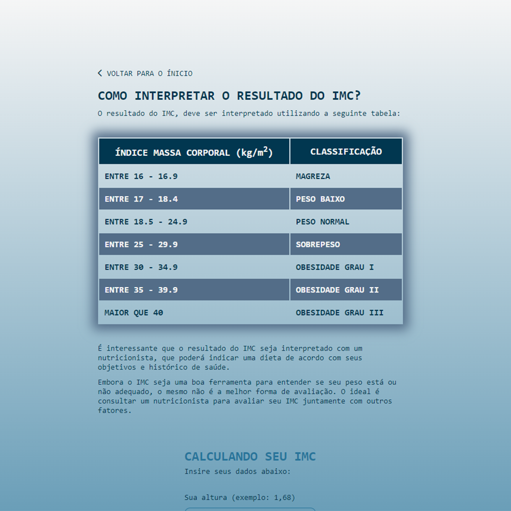

# Projeto calculadora de IMC.
- Projeto adaptado do curso Frontend - ZP da B7WEB.

- Além da implentação do arquivo incial para a introdução do projeto, no mesmo foi feito alterações no layout e mudanças nos nomes das clases e id. 

- Tecnologias usadas nesse projeto.
    

        
        
        
    

## Imagens do projeto finalizado.

